# run_Deploy.bat 흐름도

## 개요

Nexacro 프로젝트를 빌드하고 배포 엔진(`deploy_engine`)을 구성하는 배포 자동화 스크립트.

---

## 전체 흐름도

```mermaid
flowchart TD
    A([▶ run_Deploy.bat 시작]) --> B

    %% --- Step 1 ---
    B["📋 Step 1\ndeploy_config.txt 존재 확인"]
    B --> B1{파일 존재?}
    B1 -- 없음 --> ERR1["❌ ERROR\ndeploy_config.txt not found\n→ exit /b 1"]
    B1 -- 있음 --> C

    %% --- Step 2 ---
    C["📖 Step 2\ndeploy_config.txt 파싱\n(= 구분자로 key/value 읽기)"]
    C --> C1["변수 설정\nProjectPath\nOutputPath\nDeployPath\nNexacroLibPath\nGenerateRule\nOPT_MERGE / OPT_COMPRESS / OPT_SHRINK"]
    C1 --> D

    %% --- Step 3 ---
    D["✅ Step 3\n필수 필드 누락 검사"]
    D --> D1{누락된 필드 있음?}
    D1 -- 있음 --> ERR2["❌ ERROR\nMissing fields in deploy_config.txt\n→ exit /b 1"]
    D1 -- 없음 --> E

    %% --- Step 4 ---
    E["🗑️ Step 4\nOutputPath / DeployPath\n기존 폴더 삭제 후 재생성"]
    E --> F

    %% --- Step 5 ---
    F{"🔍 Step 5\nJAVA_HOME 설정 여부 확인"}
    F -- 이미 설정됨 --> G
    F -- 미설정 --> F1

    F1["Priority 1\n고정 경로 탐색\nC:\\microsoft-jdk-21...\\bin\\java.exe"]
    F1 --> F1R{발견?}
    F1R -- Yes --> G
    F1R -- No --> F2

    F2["Priority 2\n레지스트리 JDK 탐색\nHKLM\\SOFTWARE\\JavaSoft\\JDK"]
    F2 --> F2R{발견?}
    F2R -- Yes --> G
    F2R -- No --> F3

    F3["Priority 3\n레지스트리 JRE 탐색\nJava Runtime Environment"]
    F3 --> F3R{발견?}
    F3R -- Yes --> G
    F3R -- No --> F4

    F4["Priority 4\nPATH에서 java 탐색\n(where java)"]
    F4 --> F4R{발견?}
    F4R -- Yes --> G
    F4R -- No --> ERR3["❌ ERROR\nJAVA_HOME not found\n→ exit /b 1"]

    G["☕ java_found\nJAVA_HOME 확정 출력"]
    G --> H

    %% --- Step 6 ---
    H["📂 Step 6\nstart.bat 존재 확인\nD:\\...\\Jar\\bin\\start.bat"]
    H --> H1{파일 존재?}
    H1 -- 없음 --> ERR4["❌ ERROR\nstart.bat not found\n→ exit /b 1"]
    H1 -- 있음 --> I

    %% --- Step 7 ---
    I["🔧 Step 7\n배포 명령어 조립\nstart.bat -P -B -O -GENERATERULE -D\n+ 옵션: -MERGE / -COMPRESS / -SHRINK"]
    I --> J

    %% --- Step 8 ---
    J["▶️ Step 8\n배포 명령 실행\npushd → call start.bat → popd"]
    J --> K

    %% --- Step 9 ---
    K["📁 Step 9\ndeploy_engine 폴더 생성\n(기존 폴더 삭제 후 재생성)\nnexacrolib 복사\nGenerateRule 복사"]
    K --> L

    %% --- Step 10 ---
    L["🧩 Step 10\ncomponent JSON 파일 복사\n→ deploy_engine\\nexacrolib\\component\\\n서브폴더 목록 복사:\nComComp / CompBase / CompBaseEx /\nDesignComp / DeviceAPI / Graphics /\nGrid / ListView / MobileComp /\nPush / XAgent"]
    L --> L2

    L2["🔄 Step 10-1\n*.min.json 처리\nCOMP_DEST 전체 탐색(재귀)\n① 기존 *.json 삭제\n② *.min.json → *.json 으로 이름 변경"]
    L2 --> L3

    L3["📋 Step 10-2\nnexacrolib.json 복사\nnexacrolib\\nexacrolib.json\n→ deploy_engine\\nexacrolib\\nexacrolib.json"]
    L3 --> L4

    L4["📂 Step 10-3\nDesignComp 폴더 복사\nnexacrolib\\nexacrolib\\component\\DesignComp\n→ deploy_engine\\nexacrolib\\component\\DesignComp"]
    L4 --> L5

    L5["📄 Step 10-4\nResource.json 복사\nnexacrolib\\nexacrolib\\resources\\Resource.json\n→ deploy_engine\\nexacrolib\\resources\\Resource.json\n(resources 폴더 없으면 자동 생성)"]
    L5 --> M

    %% --- Step 11 ---
    M["📄 Step 11\nFramework.min.json\n→ Framework.json 으로 복사\nframework\\metainfo 폴더 복사"]
    M --> N

    %% --- Step 12 ---
    N["🗜️ Step 12\ndeploy_engine 폴더를\ndeploy_engine.zip 으로 압축\n(PowerShell Compress-Archive)"]
    N --> Z

    Z([✅ 완료])

    %% 스타일
    style A fill:#4CAF50,color:#fff
    style Z fill:#4CAF50,color:#fff
    style ERR1 fill:#f44336,color:#fff
    style ERR2 fill:#f44336,color:#fff
    style ERR3 fill:#f44336,color:#fff
    style ERR4 fill:#f44336,color:#fff
```



---

## 단계별 상세 설명

| 단계 | 작업 | 입력 | 출력 / 결과 |
|------|------|------|------------|
| **Step 1** | `deploy_config.txt` 존재 확인 | `%SCRIPT_DIR%deploy_config.txt` | 없으면 오류 종료 |
| **Step 2** | 설정 파일 파싱 (`key=value`) | `deploy_config.txt` | 환경변수 5개 + 옵션 3개 설정 |
| **Step 3** | 필수 필드 누락 검사 | 파싱된 변수 | 누락 시 오류 종료 |
| **Step 4** | 출력/배포 디렉토리 초기화 | `OutputPath`, `DeployPath` | 삭제 후 빈 폴더 재생성 |
| **Step 5** | JAVA_HOME 자동 탐색 | 환경변수 / 레지스트리 / PATH | JAVA_HOME 확정 (4단계 우선순위) |
| **Step 6** | `start.bat` 존재 확인 | `D:\git_prj\nexacroN\Jar\bin\start.bat` | 없으면 오류 종료 |
| **Step 7** | 배포 명령어 문자열 조립 | 설정 변수 + 옵션 플래그 | `DEPLOY_CMD` 변수 |
| **Step 8** | 배포 명령 실행 | `DEPLOY_CMD` | Nexacro 빌드 결과물 생성 |
| **Step 9** | `deploy_engine` 폴더 구성 | `DeployPath`, `GenerateRule` | nexacrolib + GenerateRule 복사 |
| **Step 10** | component 파일 복사 | `nexacrolib\component` 소스 | JSON + 11개 서브폴더 복사 |
| **Step 10-1** | `*.min.json` → `*.json` 치환 | `deploy_engine\nexacrolib\component` (재귀) | 기존 `.json` 삭제 후 `.min.json` 을 `.json` 으로 이름 변경 |
| **Step 10-2** | `nexacrolib.json` 복사 | `nexacrolib\nexacrolib.json` | `deploy_engine\nexacrolib\nexacrolib.json` 생성 |
| **Step 10-3** | `DesignComp` 폴더 복사 | `nexacrolib\nexacrolib\component\DesignComp` | `deploy_engine\nexacrolib\component\DesignComp` 생성 |
| **Step 10-4** | `Resource.json` 복사 | `nexacrolib\nexacrolib\resources\Resource.json` | `deploy_engine\nexacrolib\resources\Resource.json` 생성 |
| **Step 11** | framework 파일 복사 | `nexacrolib\framework` 소스 | `Framework.json` + `metainfo` 폴더 복사 |
| **Step 12** | ZIP 압축 | `deploy_engine` 전체 폴더 | `deploy_engine.zip` 생성 |

---

## deploy_config.txt 설정 항목

```ini
ProjectPath    = <Nexacro 프로젝트 경로>
OutputPath     = <빌드 출력 경로>
DeployPath     = <배포 대상 경로>
NexacroLibPath = <Nexacro 라이브러리 경로>
GenerateRule   = <GenerateRule 파일 경로>

# 선택적 옵션 (값 없이 키만 명시)
-MERGE
-COMPRESS
-SHRINK
```

---

## JAVA_HOME 탐색 우선순위

```
Priority 1 ── 고정 경로: C:\microsoft-jdk-21.0.9-windows-x64\jdk-21.0.9+10
    ↓ (없을 시)
Priority 2 ── 레지스트리 JDK (Java 9+): HKLM\SOFTWARE\JavaSoft\JDK
    ↓ (없을 시)
Priority 3 ── 레지스트리 JRE (Java 8): HKLM\SOFTWARE\JavaSoft\Java Runtime Environment
    ↓ (없을 시)
Priority 4 ── PATH 환경변수: where java 명령으로 탐색
    ↓ (없을 시)
ERROR ─────── JAVA_HOME not found → 종료
```

---

## 최종 출력물 구조

```
deploy_engine\
├── nexacrolib\
│   ├── nexacrolib.json      ← nexacrolib\nexacrolib.json 복사본 (Step 10-2)
│   ├── component\
│   │   ├── *.json           ← *.min.json 있으면 대체됨 (Step 10-1)
│   │   ├── DesignComp\      ← component\DesignComp 복사본 (Step 10-3)
│   │   ├── ComComp\
│   │   ├── CompBase\
│   │   ├── CompBaseEx\
│   │   ├── DesignComp\
│   │   ├── DeviceAPI\
│   │   ├── Graphics\
│   │   ├── Grid\
│   │   ├── ListView\
│   │   ├── MobileComp\
│   │   ├── Push\
│   │   └── XAgent\
│   ├── resources\
│   │   └── Resource.json    ← nexacrolib\resources\Resource.json 복사본 (Step 10-4)
│   └── framework\
│       ├── Framework.json   ← Framework.min.json 복사본 (Step 11)
│       └── metainfo\
├── <GenerateRule 파일>
└── deploy_engine.zip        ← 전체 압축본
```
